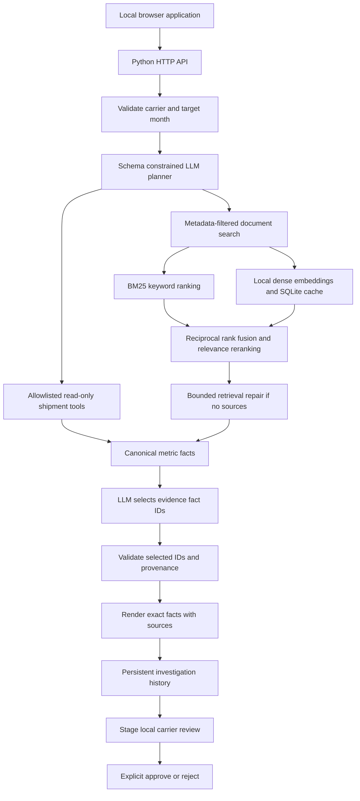

# Architecture and engineering decisions

## RAG
Documents are split into bounded chunks with overlap. Carrier and effective-month filters are applied before ranking. BM25 and dense cosine similarity create separate ranked lists. Reciprocal rank fusion combines them; a documented relevance score reranks candidates using lexical relevance, dense similarity, and title coverage. This is a lightweight deterministic reranker, not a trained cross-encoder.

The all-minilm embedding model runs through Ollama. SQLite caches vectors by a SHA-256 key including model name and text. A changed text or model uses a different key. Failed embedding calls produce a visible BM25 fallback.

PDF ingestion uses pypdf and retains page numbers. Markdown retains heading metadata. Scanned PDFs need OCR and are rejected if no text is extracted.

## Agentic workflow
The local chat model chooses from three read-only tools: search_documents, shipment_metrics, and compare_months. A schema and explicit validation reject unknown or duplicate tool names. Application gates ensure requested quantitative evidence is not skipped.

Planning and composition have two attempts each. Empty retrieval may receive one model query rewrite; carrier and date filters remain fixed. No arbitrary SQL, shell execution, internet browsing, or external messaging tool is exposed.

A model failure is disclosed in the trace and uses the offline deterministic workflow. The full live path has been tested separately from mocked unit tests.

## Answer verification
The language model selects canonical fact IDs rather than writing unrestricted numerical claims. Quantitative facts are constructed from fixed SQL results. Document facts are exact extracted source sentences. Unknown fact IDs and source IDs are rejected before rendering.

This design trades flexible prose for verifiable answers. It is constrained evidence composition, not unrestricted conversational generation. Provenance checking cannot prove that an uploaded document is true, that sources are complete, or that the selected answer addresses every aspect of the question.

## State and review approval
Each completed investigation is saved in SQLite with question, trace, evidence, and elapsed time. Review requests are stored as pending, then atomically changed to approved or rejected. Duplicate decisions are rejected. Records can be inspected after a server restart.

Approvals create local review records only; they never notify a real carrier.

## Operational boundaries
The server listens on localhost. Browser writes require a custom header and same-origin checks. Uploads have size, type, extraction, and page limits. Obvious embedded instruction patterns are quarantined. These controls are exercised in tests but are not a comprehensive security audit.

Models and generated databases are excluded from Git. Runtime requires Python and pypdf; model inference uses Ollama over a fixed local HTTP endpoint.

